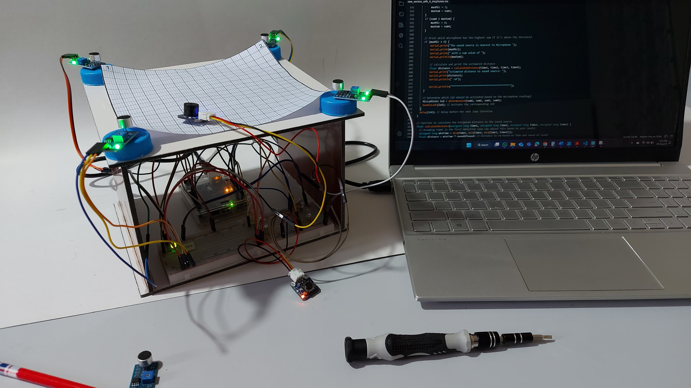

# Localization and tracking of moving targets by microphones.
This project demonstrates a sound localization and tracking system using an array of microphones. The primary goal is to determine the direction and approximate distance of a sound source using the Time Difference of Arrival (TDOA) method. This repository contains source code for both a two-microphone setup and a more robust four-microphone configuration.

Keywords: `acoustics`; `sound source localization`; `robotics`; `artificial intelligence`; `microphone arrays`

## Features
- **Two-Microphone Setup**: A simpler setup designed for initial testing. While it provides basic localization capabilities, its accuracy and reliability are limited.
- **Four-Microphone Setup**: An advanced setup that improves localization accuracy by using four microphones arranged in a square configuration. This setup enhances spatial resolution and provides more accurate direction and distance estimation.

## System Components
- **Microphones**: LM393 sound detection sensor modules.
- **Microcontroller**: Arduino Uno to process microphone inputs and control LEDs and a buzzer.
- **LED Indicators**: Provide visual feedback by lighting up to indicate the direction of the detected sound.
- **Buzzer**: An active buzzer that emits a sound, serving as a controlled input for testing.

## Setup Instructions
- **Hardware Connections**: Connect the microphones, LEDs, buzzer, and button switch to the Arduino as outlined in the project documentation.
- **Software Requirements**: Install the Arduino IDE to upload code to the Arduino Uno. Ensure that standard Arduino libraries are up-to-date.
- **Uploading Code**: Use the Arduino IDE to upload the relevant .ino file from this repository to the Arduino Uno.

## Code Description
- `localization_with_2_microphones.ino`: Code for the two-microphone setup. This script detects the direction of sound based on the time difference in sound arrival at the two microphones.
- `localization_with_4_microphones.ino`: Code for the four-microphone setup. It calculates time differences at all four microphones to provide more accurate localization.

## Demonstration Videos
Two demo videos have been created to illustrate the functionality of the system:

https://github.com/user-attachments/assets/d8f2545a-3980-4d05-93b0-431d0095a585

https://github.com/user-attachments/assets/02aa724f-1692-4350-bf2a-b55af739774c

## Limitations and Future Work
While the current implementation demonstrates the feasibility of sound localization using low-cost materials, accuracy is not always optimal, especially in noisy environments. Future enhancements could involve integrating advanced noise reduction techniques and exploring machine learning models for improved adaptability and precision.

## License
This project is licensed under the MIT License.
 
## CREDITS AND REFERENCES
Author: [Hemant Ramphul](https://www.linkedin.com/in/hemantramphul/)
 Date: 02 September, 2024  
Project: Localization and tracking of moving targets by microphones

For more information and updates, visit the project's URL: [Localization and tracking of moving targets by microphones](https://github.com/hemantramphul/Localization-and-tracking-of-moving-targets-by-microphones)

Feel free to reference this project in your projects and studies, giving appropriate credit to the author.
